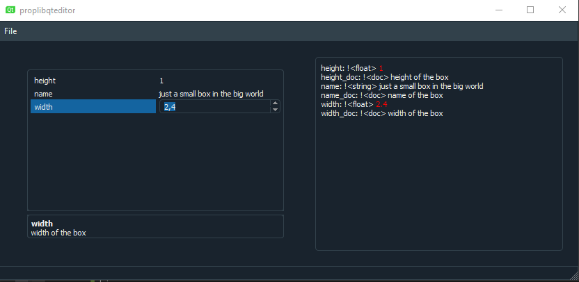
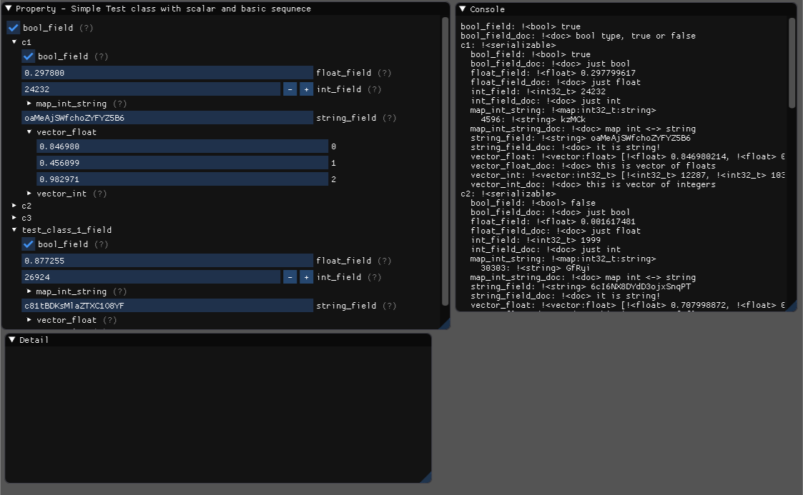

[](https://travis-ci.org/Lishen1/proplib)
# Properties serialization library
**proplib** is a set of crossplatform c++11 libraries and tools which allow serialize, deserialize, visualize and edit c++ objects without codegeneration what well suitable for algorithms  properties configuration.

## Example of usage

```cpp
#include <fstream>
#include <iostream>

#include <serialize/serializable.h>
#include <serialize/serialize.h>
#include <yaml-cpp/yaml.h>

class Box : public proplib::Serializable
{

public:
  float height;
  float width;
  std::string name;

private:
  SERIALIZE(height, "height of the box");
  SERIALIZE(width, "width of the box");
  SERIALIZE(name, "name of the box");
};

int main()
{
  Box box; 
  box.height = 1.0;
  box.width = 1.4;
  box.name = "just a small box in the big world";

  YAML::Emitter out;
  box.serialize(out, false);
  std::ofstream outfile;
  outfile.open("box.prop.yml");
  outfile << out.c_str() << std::endl;
  outfile.close();

  box.height = 0.0;
  box.width = 0.0;
  box.name = "--";

  box.deserialize(YAML::LoadFile("box.prop.yml"));

  std::cout << "box.height " << box.height << std::endl;
  std::cout << "box.width " << box.width << std::endl;
  std::cout << "box.name " << box.name << std::endl;

  system("pause");
  return 0;
}
```
box.prop.yml file content:
``` yaml
height: 1
name: just a small box in the big world
width: 1.4
```

console output:
```
box.height 1
box.width 1.4
box.name just a small box in the big world
Для продолжения нажмите любую клавишу . . .
```
Also we can serialize **box** with **docstrings** and metainfo for gui generation

```cpp
box.serialize(out, true);
```

box.prop.yml file content:
``` yaml
height: !<float> 1
height_doc: !<doc> height of the box
name: !<string> just a small box in the big world
name_doc: !<doc> name of the box
width: !<float> 1.4
width_doc: !<doc> width of the box
```
then we can open, edit and save this file in **proplib-qt-editor**



or in ImGui based **proplib-imgui-editor**



## Supported types
- arithmetic
- bool
- std::string 
- std::map
- std::vector

## Supported formats
- YAML

## Components
- **proplib-serialize** - serialization/deserialization lib
- **proplib-gui**
  - **proplib-qt-gui**  - qt based qui lib
- **proplib-qt-editor** -  qt based editor app
- **propsdk-imgui-editor** -  imgui based editor app
- **tests**
  - **prop-serialize** - serialization/deserialization test
  - **http-client** - remote transfer test

## Future work
- support JSON format
- support binary format
- support enums serialization/deserialization
- add meta info in **docstring** like hints for better data representation and hins about possible values of object fields
- minimize transferred data size


